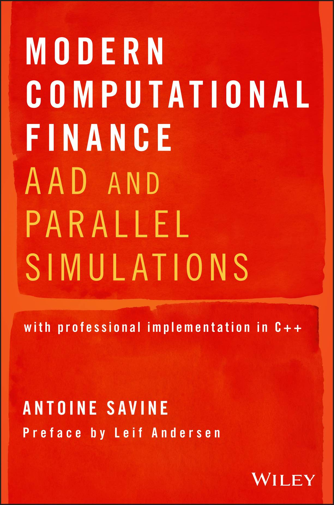

# Companion code for "Modern Computational Finance: AAD and Parallel Simulations" (Antoine Savine, Wiley, 2018)

This is the professional implementation in C++ of the book Modern Computational Finance: AAD and Parallel Simulations by Antoine Savine. The code is freely available to anyone. Any person who purchased a copy of the book is authorized to use, modify and distribute the code for any application, as long as the credits remain on the top of the files.

In this repository, readers will find:

The source code listed or referenced in the publication.

The files AAD*.* (with a dependency on gaussians.h for the analytic differentiation of Gaussian functions, and blocklist.h for memory management, both included) constitute a self contained, general purpose AAD library. The code builds on the advanced techniques exposed in this publication, in particular those of chapters 10, 14 and 15 to produce a particularly fast differentiation library, applicable to many contexts. The code is progressively built and explained in part III.

The files mc*.* (with dependency on various utility files, all included in the project) form a generic, parallel, financial simulation library. The code and its theoretical foundations are described in part II.
Various files with support code for memory management, interpolation or concurrent data structures, such as threadPool.h, which is developed in part I and used throughout the book to execute tasks in parallel.

A file main.h that lists all the higher level functions that provide an entry point into the combined library.

A Visual Studio 2017 project wrapping all the source files, with project settings correctly set for maximum optimization. The code uses some C++ 17 constructs, so the project setting "C++ Language Standard" on the project property "C/C++ / Language / C++ Language Standard" must be set to "ISO C++ 17 standard". This setting is correctly set on the project file xlComp.vcxproj, but readers who compile the files by other means must be aware of this.

A number of xl*.* files that contain utilities and wrappers to export the main functions to Excel, as a particularly convenient front end for the library. The project file xlComp.vcxproj is set to build an xll, a file that is opened from Excel and makes the exported library functions callable from Excel like its standard functions. We wrote a tutorial that explains how to export C++ code to Excel. The tutorial ExportingCpp2xl.pdf is available in the the folder xlCpp along with the necessary source files. The wrapper xlExport.cpp file in our project precisely follows the directives of the tutorial and readers can inspect it to better understand these techniques.

Finally, we provide a pre-built xlComp.xll (to run xlComp.xll, readers may need to install Visual Studio redistributables VC_redist.x86.exe and VC_redist.x64.exe, also included in the repository) and a spreadsheet xlTest.xlsx that demonstrates the main functions of the library. All the figures and numerical results in this publication were obtained with this spreadsheet and this xll, so readers can reproduce them immediately. The computation times were measured on an iMac Pro (Xeon W 2140B, 8 cores, 3.20 GHz, 4.20 max) running Windows 10. We also carefully checked that we have \emph{consistent} calculation times on a recent quad core laptop (Surface Book 2, i7-8650U, 4 cores, 1.90 GHz, 4.20 max), that is, (virtually) identical time in single threaded mode, twice the time in multi-threaded mode.

The code is entirely written in standard C++, and compiles on Visual Studio 2017 out of the box, without any dependency to a third party library.

The branch 'AADBook' is frozen and reflects the code in the book as published. The master branch may evolve. Other branches contain specific implementations based on the library. For example, the 'MutliAssets' branch contains developments to extend the library to support multiple underlying assets, like basket options or autocalls. They will eventually merge into Master but not AADBook.

# Comp Fin Lecture
# Computational Finance and Machine Learning in Finance

The repo 'CompFinLecture' contains the slides and material for the lectures based on the book. This is a softer introduction to some of the themes covered in the book, which also introduces deep learning and its application to derivatives finance, and establishes parallels between the back-propagation algorithm, at the core of deep learning, and AAD. This parallel, in turn, provides further intuition into the mechanics of AAD. 

These lectures are delivered as courses or workshops at Copenhagen University, Aarhus University and Kings College London. The lecture notes, C++ code and TensorFlow notebooks are freely available in the 'CompFinLectures' repo. 

The lectures demonstrate AAD and its application to finance with "toy code", which is particularly easy to understand and reproduce, but is not efficient or scalable to professional standard, and not suitable for production. The code in this repo ('CompFinance'), on the contrary, is efficient, compliant with professional C++ development standards and designed to scale to production.
